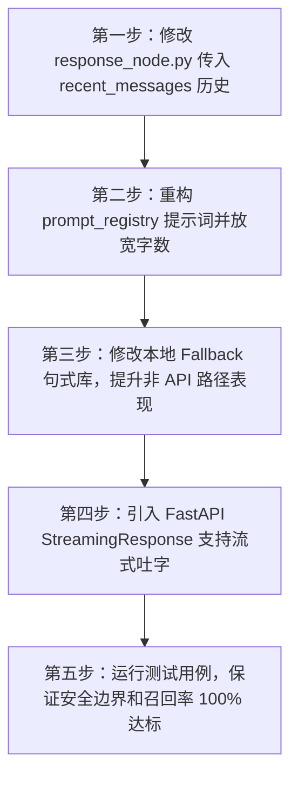

# Agent 回复“机械/人机”改进方案

本方案旨在解决当前校园心理支持 Agent 回复过于死板、套路化以及高延迟导致的人机感问题，从多轮上下文、提示词柔性化、流式传输以及 Fallback 机制四个维度进行优化。

## 一、 问题诊断

### 1. 历史对话上下文（Context History）丢失
在核心回复生成节点 [response_node.py](file:///e:/python_file/myagent/app/agent/nodes/response_node.py) 中，`_response_user_prompt` 函数只将当前的 `state.user_message` 发送给了 LLM：
```python
def _response_user_prompt(state: AgentState) -> str:
    # ...
    return (
        f"用户消息：{state.user_message}\n"
        # ... 仅包含风险摘要、行动建议和 RAG 知识，没有包含 recent_messages 历史记录
    )
```
这导致大模型在多轮对话中处于“失忆”状态，无法理解上文逻辑和情绪铺垫，每次回复都像第一次对话一样生硬。

### 2. 提示词约束过紧且生硬
在 [prompt_registry.py](file:///e:/python_file/myagent/app/llm/prompt_registry.py) 的 `"response_generation_v1"` 提示词中：
* 硬性限制 `"回复控制在 120 字以内"`，使大模型必须在极短篇幅内塞入“情绪共情 + 风险提示 + RAG 知识 + 建议行动 + 下步追问”，导致语气过于紧绷、程式化。
* 缺乏明确的倾听和共情策略（如情绪命名、开放式提问、去诊断化表述等具体心理咨询技术指引）。

### 3. 本地 Fallback 模板极度套路化
在 [response_node.py](file:///e:/python_file/myagent/app/agent/nodes/response_node.py) 的 `_normal_response` 函数中，本地 Fallback 回复采用硬编码拼接：
```python
"从你的描述看，我观察到{observed_text}，这不是诊断，但提示可以进一步筛查和照顾自己..."
```
一旦 API 调用失败、网络超时或配置成 LocalProvider，前端就会收到这种几乎完全一样、像机器人通知单一样的回复。

### 4. 缺乏流式传输（Streaming）导致的高延迟体感
根据 `reports/evaluation/evaluation_report_real_llm_zh.md` 的评测，真实 API 的 P95 延迟为 42 秒。用户点击发送后需要等待长达数十秒才能一次性吐出所有文本，极大地破坏了即时倾诉的自然交互体验。

---

## 二、 优化方案设计

为了兼顾“专业度（安全性）”与“温暖感（人性化）”，将采取以下改进策略：

### 1. 引入多轮对话上下文 (Memory Ingestion)
修改 [response_node.py](file:///e:/python_file/myagent/app/agent/nodes/response_node.py) 中的 `_response_user_prompt` 逻辑，格式化 `state.recent_messages` 为对话历史，使 LLM 能够理解当前交流的语境上下文：
```python
# 拟修改为：
def _response_user_prompt(state: AgentState) -> str:
    # 提取最近几轮对话历史并转化为 string 格式
    history_lines = []
    for msg in state.recent_messages[-6:]: # 保留最近3轮交互
        role_label = "用户" if msg["role"] == "user" else "心理助手"
        history_lines.append(f"{role_label}：{msg['content']}")
    history_context = "\n".join(history_lines)
    
    # 将 history_context 作为用户 Prompt 的一部分传入
```

### 2. 柔性提示词与倾听技术注入
重构 [prompt_registry.py](file:///e:/python_file/myagent/app/llm/prompt_registry.py) 中的 `"response_generation_v1"` 系统提示词：
* **字数放宽：** 将字数限制放宽到 **200~250字**。
* **沟通策略注入：** 要求 LLM 遵循基本的心理咨询沟通技术：
  1. **情绪命名：** 确认并说出用户的情绪感受（如：“听起来你感到有些无助和焦虑……”）。
  2. **非批判态度：** 避免说教，接纳用户负面情绪。
  3. **去标签化表达：** 将“症状”柔性地描述为“近期的困扰和紧绷状态”，而非干瘪的“观察到抑郁信号”。
  4. **行动解耦：** 建议的行动应该以探讨的语气提供，而不是命令式语气。

### 3. 增强流式传输支持 (Streaming)
* 在 [OpenAICompatibleProvider](file:///e:/python_file/myagent/app/llm/openai_compatible_provider.py) 中增加流式接口，支持异步生成器（Generator）输出。
* 重构 `POST /api/chat/messages` API 接口，利用 FastAPI 的 `StreamingResponse` 将 LLM 生成的 token 实时推送至前端，极大地减少首字响应时间（TTFT），创造丝滑的倾听体验。

### 4. 优化本地 Fallback 句式库
丰富 `_normal_response` Fallback 的句式库，增加多种温暖、通俗的心理共情句式模板进行随机或根据风险等级匹配选择，避免单一的拼接话术。

---

## 三、 实施步骤



### 计划排期

| 任务名称 | 具体改动文件 | 预期目标 |
| :--- | :--- | :--- |
| **多轮上下文与 Prompt 调优** | [response_node.py](file:///e:/python_file/myagent/app/agent/nodes/response_node.py)<br>[prompt_registry.py](file:///e:/python_file/myagent/app/llm/prompt_registry.py) | 对话连续性良好，回复字数在200字左右，共情能力大幅提升。 |
| **本地 Fallback 句式润色** | [response_node.py](file:///e:/python_file/myagent/app/agent/nodes/response_node.py) | 即使断网或 API 报错，Fallback 的纯规则回复也显得真诚自然。 |
| **API 流式接口改造** | [chat.py](file:///e:/python_file/myagent/app/api/routes/chat.py)<br>[openai_compatible_provider.py](file:///e:/python_file/myagent/app/llm/openai_compatible_provider.py) | 前端实现打字机效果吐字，响应首字延迟小于 1 秒。 |
| **全量用例回归测试** | `tests/integration/test_evaluation_cases.py` | 确保在改动 Prompt 结构后，55条安全与危机筛查测试依然 100% 通过。 |
