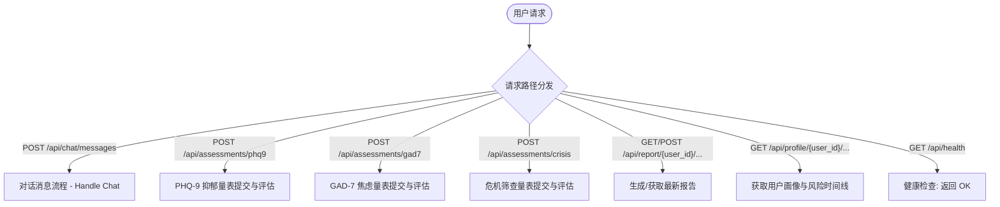
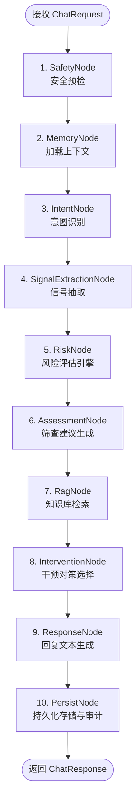
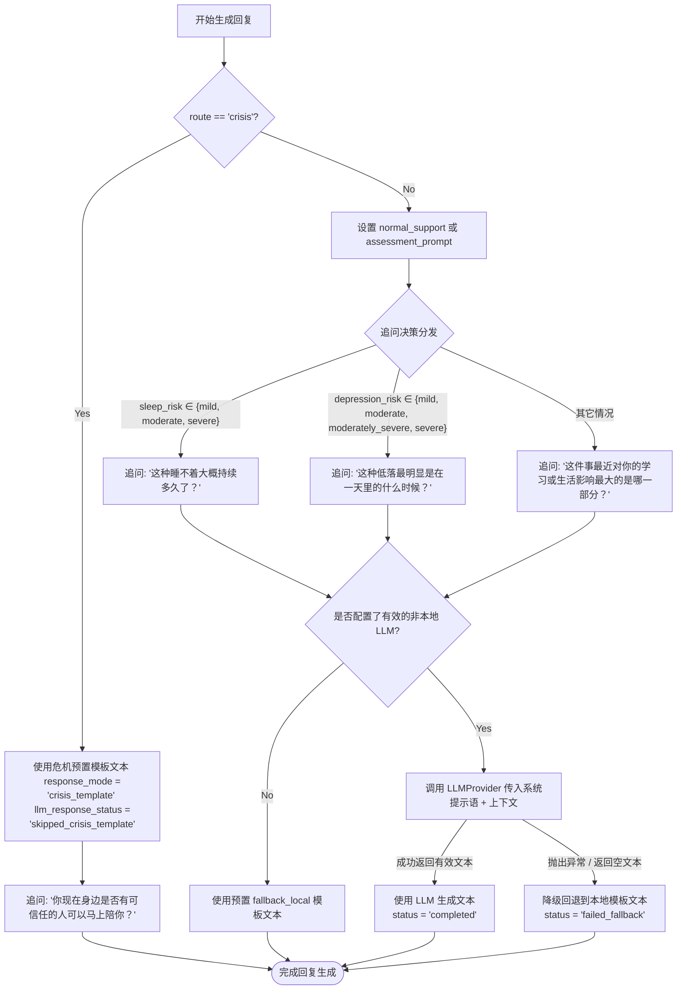

# Campus Psy Agent 项目完整工作流程图

本项目是一个校园心理支持 Agent 系统，具有多渠道评估、临床指标提取、风险评估引擎、RAG 知识库检索、动态干预生成以及基于安全策略的危机处理和持久化存储等功能。

---

## 1. 核心流程总览 (FastAPI API 路由入口)

系统由 FastAPI 构建，提供以下几种主要服务入口：



---

## 2. 对话消息流水线分支详解 (POST /api/chat/messages)

对话流水线（`PipelineRunner`）由 **10 个节点** 顺序执行，每个节点有其内部逻辑与分支。



### 各节点内部详细逻辑分支

#### 1. SafetyNode (安全预处理)
*   **输入**：用户原始消息。
*   **处理**：调用 `SignalExtractor` 进行规则提取。
*   **分支**：
    *   `"主动自杀想法" ∈ risk_markers` ➡️ 将 `state.route` 设为 `"crisis"`。
    *   否则 ➡️ 保持原有 `route` 不变。

#### 2. MemoryNode (记忆加载)
*   **处理**：
    *   从 `ConversationRepository` 获取最近的 10 条历史消息，反转为时间正序。
    *   尝试从 `ProfileRepository` 获取用户的 Profile 画像。若发生异常，则回退为 `{}`。

#### 3. IntentNode (意图分类)
*   **逻辑分支**：
    *   **分支 A**：如果当前已判定 `state.route == "crisis"` ➡️ 设置 `state.intent = "crisis"`。
    *   **分支 B**：如果用户输入包含 `"GAD-7"`、`"PHQ-9"`、`"量表"`、`"筛查"` ➡️ 设置 `state.intent = "assessment"`, 并将 `state.route = "assessment"`。
    *   **分支 C**：否则 ➡️ 设置 `state.intent = "support"`（普通支持）。

#### 4. SignalExtractionNode (临床信号抽取)
*   **处理**：
    *   执行规则提取（`SignalExtractor.extract`）。
    *   若配置了 LLM Extractor ➡️ 异步调用 LLM 抽取并更新状态为 `"completed"`（异常时更新为 `"failed"` 并记录审计）。
    *   安全合并（`merge_signals_safely`）：将规则信号与 LLM 信号合并。其中 LLM 抽取的信号必须在白名单内（`ALLOWED_EMOTIONS`, `ALLOWED_SYMPTOMS` 等）。

#### 5. RiskNode (风险评估逻辑)
*   调用 `RiskEngine.assess(signals)` 进行临床指标判定。
*   **危机评级 `_crisis_from_markers` 分支**：
    *   `{"主动自杀想法", "计划", "准备工具"} ⊆ markers` ➡️ `crisis_level = "s4"`
    *   `"主动自杀想法"` 且有任一 `{"方式", "计划", "准备工具"}` ➡️ `crisis_level = "s3"`
    *   仅有 `"主动自杀想法"` ➡️ `crisis_level = "s2"`
    *   仅有 `"被动死亡想法"` ➡️ `crisis_level = "s1"`
    *   否则 ➡️ `crisis_level = "s0"`
*   **状态转换分支**：
    *   如果 `crisis_level` 属于 `{"s2", "s3", "s4"}` ➡️ 强制将 `state.route = "crisis"`。
*   **指标分析分支**：
    *   **焦虑焦虑评级 `anxiety_risk`**：
        *   有 `"焦虑"` 情绪或存在任何压力源（`stressors`）➡️ 设为 `"mild"`。
        *   在 `"mild"` 基础上，若满足（持续时间 $\ge 2$ 周或频次为高频或有功能受损）➡️ 设为 `"moderate"`。
    *   **抑郁评级 `depression_risk`**：
        *   有 `"低落"` 情绪或有 `{"自责", "兴趣下降"}` ➡️ 设为 `"mild"`。
        *   在 `"mild"` 基础上，若满足（持续时间 $\ge 2$ 周或症状数 $\ge 2$）➡️ 设为 `"moderate"`。
    *   **睡眠评级 `sleep_risk`**：
        *   有 `"失眠"` 症状 ➡️ 设为 `"mild"`。
        *   在 `"mild"` 基础上，若满足（持续时间 $\ge 2$ 周或睡眠影响了社交/学习功能）➡️ 设为 `"moderate"`。
    *   **功能受损评级 `function_impairment_level`**：
        *   无功能受损 ➡️ `"none"`
        *   受损维度数 $= 1$ ➡️ `"mild"`
        *   受损维度数 $\ge 2$ ➡️ `"moderate"`

#### 6. AssessmentNode (筛查量表推荐生成)
*   **量表匹配分支**：
    *   若意图是 `"assessment"`：
        *   用户提到 `"GAD-7"` ➡️ 推荐 `"GAD-7"`
        *   用户提到 `"PHQ-9"` ➡️ 推荐 `"PHQ-9"`
        *   用户提到 `"危机"` 或 `"自杀"` ➡️ 推荐 `"crisis screen"`
    *   若根据风险引擎评估：
        *   `anxiety_risk` 属于 `{"moderate", "severe"}` ➡️ 推荐 `"GAD-7"`
        *   `depression_risk` 属于 `{"moderate", "moderately_severe", "severe"}` ➡️ 推荐 `"PHQ-9"`
        *   `crisis_level` 属于 `{"s1", "s2", "s3", "s4"}` ➡️ 推荐 `"crisis screen"`

#### 7. RagNode (知识库检索)
*   **检索决策分支**：
    *   **分支 A**：`state.route == "crisis"` ➡️ **跳过检索**（`rag_behavior = "skip"`, `retrieved_knowledge = []`）。
    *   **分支 B**：`state.route != "crisis"` ➡️ 执行异步向量检索：
        *   如果检索到相关条目 ➡️ `rag_behavior = "used"`。
        *   如果检索为空 ➡️ `rag_behavior = "empty"`。
        *   写入审计日志（`RAG_RETRIEVE_COMPLETED`）。

#### 8. InterventionNode (干预对策选择)
*   **行为生成分支**：
    *   **分支 A**：如果 `crisis_level` 属于 `{"s2", "s3", "s4"}` ➡️ 强制生成转介干预：`["联系可信成年人或学校心理中心", "如果当前有立即危险，请拨打当地急救电话"]`。
    *   **分支 B**：属于普通评估路线：
        *   若 `anxiety_risk` 属于 `{"mild", "moderate", "severe"}` ➡️ 插入 `anxiety_cbt_actions`（GAD-7筛查、记录自动化担忧想法） and 首条 `mindfulness_actions`（3分钟呼吸练习）。
        *   若 `depression_risk` 属于 `{"mild", "moderate", "moderately_severe", "severe"}` ➡️ 插入 `behavioral_activation`（24小时内低成本小行动） and `depression_cbt_actions`（记录强烈负面想法并平衡重写）。
        *   若 `sleep_risk` 属于 `{"mild", "moderate", "severe"}` ➡️ 插入 `sleep_actions`（睡前30分钟远离屏幕与写下担忧）。
        *   若无任何匹配动作 ➡️ 插入默认行动：`"记录今天情绪变化，并观察睡眠、食欲和学习状态"`。
    *   **追加逻辑**：
        *   若用户消息含联系心理中心/老师的求助表达 ➡️ 追加 `"联系学校心理中心或可信任老师"`。
        *   对于 `AssessmentNode` 生成的量表建议，生成 `"建议完成 {量表} 进一步筛查"`。
    *   去重后保存至 `state.suggested_actions`。

#### 9. ResponseNode (回复文本生成)


#### 10. PersistNode (持久化与审计)
*   **持久化操作**：
    1.  确认或新建会话记录。
    2.  存储用户消息（附带当前风险快照）。
    3.  记录当前风险评估结果。
    4.  存储助手消息。
    5.  更新用户画像（情绪、症状、压力源、受损和保护因子）。
    6.  记录 `RISK_ASSESSMENT_COMPLETED` 审计日志。
    7.  若处于 `"crisis"` 路由 ➡️ 额外记录 `SAFETY_ESCALATION_TRIGGERED` 审计日志。

---

## 3. 专业筛查量表提交分支 (POST /api/assessments/...)

对于用户在前端提交的专业评测量表数据，系统会分流进入专门的计算与入库程序：

```mermaid
graph TD
    ScaleStart([量表提交]) --> ScaleType{量表类型判断}
    
    %% PHQ-9
    ScaleType -- PHQ-9 --> PHQ9Val[校验 answers 长度=9 且范围 0-3]
    PHQ9Val --> PHQ9Calc[计算 PHQ-9 总分与抑郁等级]
    PHQ9Calc --> PHQ9Save[保存评估记录]
    PHQ9Save --> PHQ9Item9{第 9 题是否阳性?}
    PHQ9Item9 -- Yes --> PHQ9Crisis[保存危机级别 s2 并标记危机复核建议]
    PHQ9Item9 -- No --> PHQ9Normal[保存普通评估结果]
    
    %% GAD-7
    ScaleType -- GAD-7 --> GAD7Val[校验 answers 长度=7 且范围 0-3]
    GAD7Val --> GAD7Calc[计算 GAD-7 总分与焦虑等级]
    GAD7Calc --> GAD7Save[保存评估记录]
    GAD7Save --> GAD7Severity{严重程度 ∈ {moderate, severe}?}
    GAD7Severity -- Yes --> GAD7Risk[保存中/重度焦虑风险记录]
    GAD7Severity -- No --> GAD7Normal[保存普通评估结果]
    
    %% Crisis Screen (简版危机筛查)
    ScaleType -- Crisis Screen --> CrisisScore[计算危机筛查等级 level]
    CrisisScore --> CrisisSave[保存危机评估记录]
    CrisisSave --> CrisisCheck{level ∈ {s2, s3, s4}?}
    CrisisCheck -- Yes (安全响应) --> CrisisLog[更新为危机路由, 记录安全升级审计日志]
    CrisisCheck -- No --> CrisisNormal[记录普通危机评估]
    
    PHQ9Crisis & PHQ9Normal & GAD7Risk & GAD7Normal & CrisisLog & CrisisNormal --> ScaleEnd([返回量表解析与下一步推荐结果])
```

---

## 4. 报告生成与画像时间线分支

### 生成/读取报告 (GET/POST `/api/report/{user_id}/...`)
1.  首先尝试从 `RiskRepository.latest_for_user` 读取最新风险记录，如果没有，则从 `ProfileRepository.get_latest_risk` 读取；若仍没有，使用默认空风险结果。
2.  读取用户的 Profile 属性和 Summary 概述。
3.  **干预生成分支**：
    *   `anxiety_risk` $\ge$ `mild` ➡️ 推荐 `"GAD-7 复测与担忧记录"`。
    *   `depression_risk` $\ge$ `mild` ➡️ 推荐 `"行为激活与支持系统连接"`。
    *   `symptoms` 包含 `"失眠"` ➡️ 推荐 `"睡眠卫生计划"`。
    *   `crisis_level` 属于 `{"s2", "s3", "s4"}` ➡️ 推荐 `"立即联系可信成年人、学校心理中心或紧急援助"`。
    *   无任何上述匹配 ➡️ 默认推荐 `"持续记录情绪、睡眠和学习状态"`。
4.  **线下求助标志分支**：
    *   若 `crisis_level` 属于 `{"s2", "s3", "s4"}` **或者** `depression_risk` $\ge$ `moderate` ➡️ 开启 `offline_help_recommended = true`。
    *   否则 ➡️ `offline_help_recommended = false`。
5.  返回结构化 Report 数据。

### 用户画像及时间线 (GET `/api/profile/{user_id}/...`)
*   **`/profile`**：获取基本画像数据（提取出的各维度列表）与最新摘要文本。
*   **`/timeline`**：拉取用户历史所有风险变化点，组成风险等级随时间波动的历史线。
